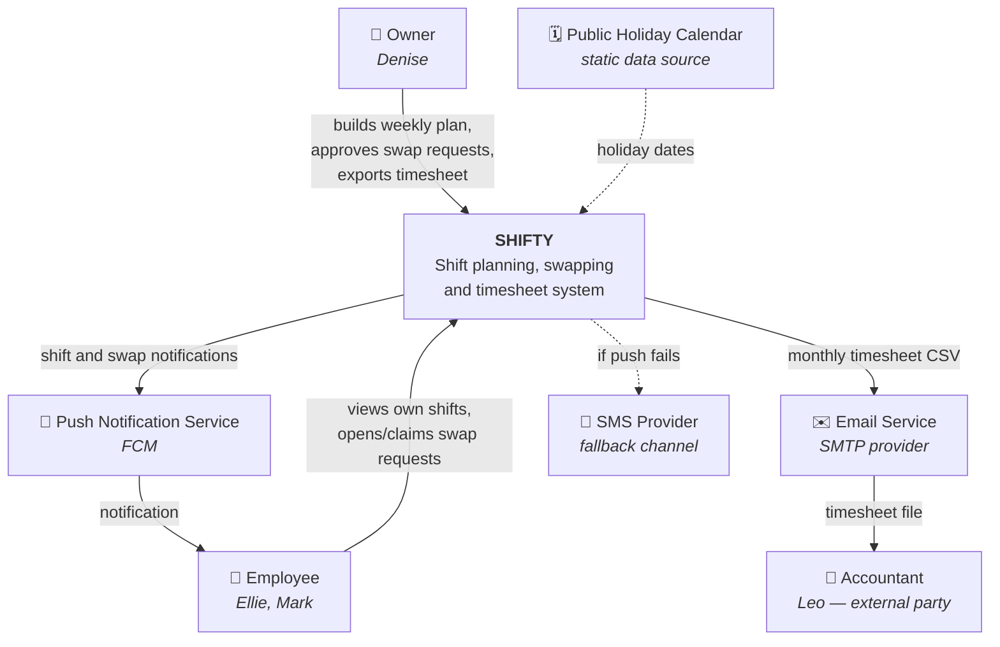
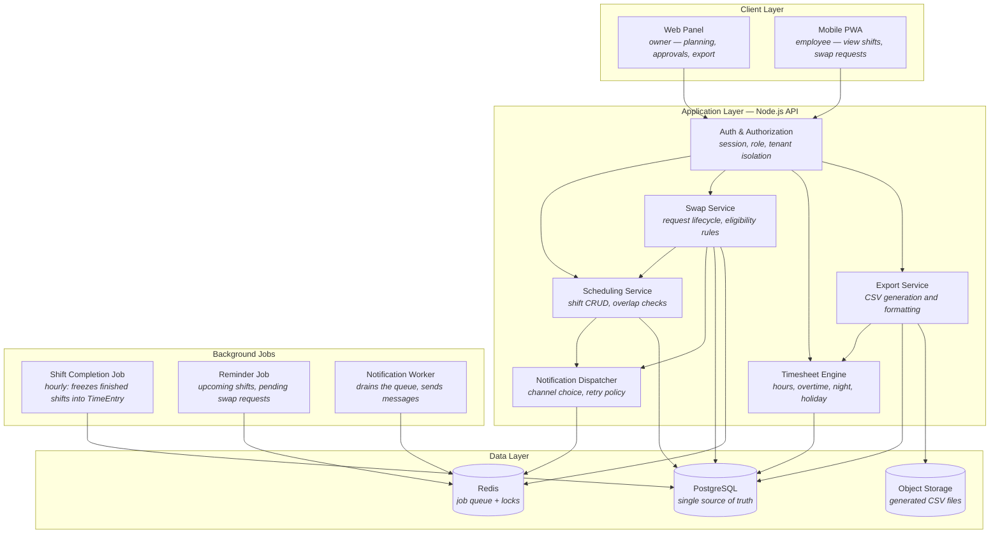
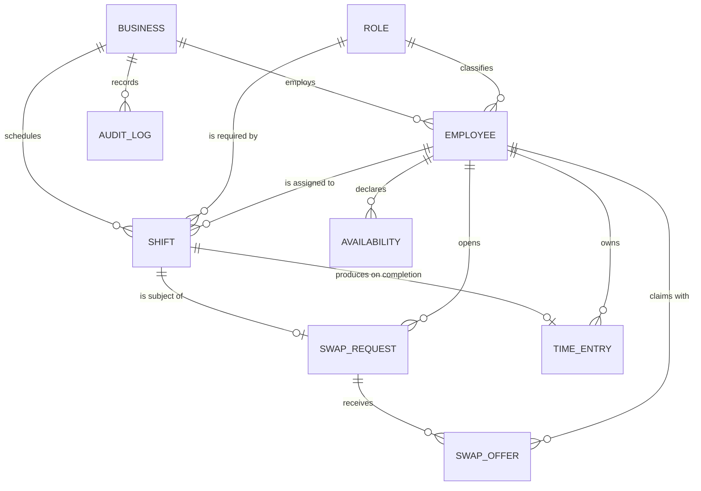

# Day 7 — Requirements & Design: High-Level Design and Architecture Sketch

**Ongoing product:** *Shifty* — a shift-planning and timesheet app for cafés and restaurants with 5–20 employees.
**Feature in focus:** Shift Swap Request (US-03/US-04) + Monthly Timesheet Export (US-05).

> The goal is not UML perfection. The goal is a shared understanding of **boundaries, data, and trade-offs** before large implementation effort. Everything below is whiteboard-level and expected to change.

---

## Task 1 — Context Diagram

The system is a single box here. The only questions are: **who uses it, and what does it talk to?**

### Boundary decisions (what I deliberately left outside)

| Left outside | Why |
|---|---|
| Payroll / salary calculation | That is the accountant's software. We produce **hours**, not **money**. This boundary also keeps legal liability outside the system. |
| POS / revenue system | Forecasting staffing from sales data is a v2 idea, not MVP scope. |
| Live integration with payroll software | Every accountant uses a different package. File exchange is the cheapest common denominator across all customers. |
| HR / hiring workflows | A different problem domain entirely. |

**Note the subtlety:** the accountant is not a *user* of the system — he is a **recipient of its output**. Making that explicit on the diagram kills the "should we give Leo a login?" debate before it starts.

---

## Task 2 — Component Sketch

### Component responsibilities

| Component | One-sentence responsibility | What it deliberately does *not* do |
|---|---|---|
| **Web Panel** | The owner's planning and approval interface | Holds no business rules; eligibility is decided by the API |
| **Mobile PWA** | The employee's own-shift view and swap flow | Never fetches another employee's hours or pay data |
| **Auth & Authorization** | Establishes identity and which business's data is reachable | Contains no domain logic |
| **Scheduling Service** | Creates/updates shifts and detects time overlaps | Knows nothing about legal hour limits — those come from the Timesheet Engine's rules |
| **Swap Service** | Runs the request state machine (Open → Claimed → Approved/Rejected/Cancelled) | Sends no notifications; it only publishes events |
| **Timesheet Engine** | Classifies raw shifts into legal buckets (regular / overtime / night / holiday) | Calculates no money, knows no file format |
| **Export Service** | Turns calculated hours into the accountant's expected file shape | Performs no calculation |
| **Notification Dispatcher** | Decides which event goes to whom over which channel | Does not deliver anything itself — it enqueues |
| **Shift Completion Job** | Freezes a finished shift into a `TimeEntry` | Never rewrites history in place |
| **PostgreSQL** | Single source of truth | Is not used as a cache or queue |
| **Redis** | Job queue and concurrency locks | Stores nothing durable |

### Why a monolith (for now)
Three people, a ten-week window. The boxes above are **modules inside one deployable application**, not separate services. Because the boundaries are drawn cleanly, splitting them out later stays possible — but splitting them today would cost more in operational overhead than it would buy.

---

## Task 3 — Data Sketch

Scope: shift swaps and timesheets.

### Main entities

| Entity | Key fields | Note |
|---|---|---|
| **Business** | id, name, timezone, week_start_day | The root filter on every query — tenant isolation |
| **Employee** | id, business_id, name, role_id, hired_on, ended_on, status | `hired_on` drives mid-month joiners in the timesheet |
| **Role** | id, name (barista, cashier, kitchen) | The primary swap-eligibility criterion |
| **Shift** | id, business_id, employee_id, starts_at_utc, ends_at_utc, role_id, status | `status`: scheduled / completed / cancelled |
| **Availability** | id, employee_id, weekday, time_range, type (available / unavailable) | Feeds plan suggestions and swap matching |
| **SwapRequest** | id, shift_id, opened_by_employee_id, status, opened_at, resolved_at | The state machine lives here |
| **SwapOffer** | id, swap_request_id, claimed_by_employee_id, status, created_at | Several offers may exist; only one can be accepted |
| **TimeEntry** | id, employee_id, shift_id, period (YYYY-MM), regular_min, overtime_min, night_min, holiday_min, rule_version | The frozen form of the timesheet |
| **AuditLog** | id, business_id, actor_id, action, target, old_value, new_value, at | Evidence trail for manual corrections and approvals |

### Critical decisions baked into this model

1. **Times are stored in UTC and displayed in the business's timezone.** So that daylight-saving changes or a second location in another region don't corrupt historical data.
2. **A shift may cross midnight.** That is why the model is built on **start and end timestamps**, not "date + shift type". Reversing this decision later would mean rewriting the entire timesheet logic.
3. **`SwapRequest` and `SwapOffer` are separate tables.** Collapsing them into one would make "two people claimed at the same moment" impossible to model correctly.
4. **When a shift is handed over, `Shift.employee_id` is updated, but `AuditLog` remembers the previous owner.** Hours go to the new owner; if a dispute arises, the history is provable.
5. **`TimeEntry` stores integer minutes.** Decimal hours (7.5) introduce rounding drift, which is unacceptable once money and labour law are involved.

---

## Task 4 — Trade-off Note

### TD-001: Timesheet hours are frozen when a shift completes

**Context**
The hours sent to the accountant at month end must be reproducible identically months later. At the same time, shift records remain editable: the owner can correct a past shift, an approved swap can change ownership, and overtime rules may change with future legislation.

**Decision**
When a shift ends, a background job (`Shift Completion Job`) writes a **`TimeEntry` record** for it: regular / overtime / night / holiday minutes calculated under the rules in force at that moment, stored alongside the rule version used. Timesheet export reads only `TimeEntry`; it never recalculates from `Shift`. If a correction is needed later, a new version of the `TimeEntry` is created — the old one is never deleted.

**Rejected alternative**
Calculate the timesheet **on the fly from the `Shift` table every time it is requested**, storing no derived data.

**Why it was rejected**
- A rule change retroactively rewrites the past: if legislation changes in June, pulling March's report a second time yields different numbers than the file already sent to the accountant.
- Months later, "where did this number come from?" has no answer — there is no audit trail.
- An innocent correction on a shift record can silently alter a closed period.

**What the decision buys and what it costs**

| Gain | Cost |
|---|---|
| Past periods are reproducible and auditable | Data lives in two places → inconsistency becomes possible |
| Rule version is recorded; "which rule produced this?" is answerable | If a rule turns out to be wrong, I must build a **recalculation/backfill** path |
| Export is fast and predictable (read, not compute) | An extra background job, an extra table, extra complexity |
| Corrections are tracked as versions | Roughly three extra days of development |

**When this decision would become wrong**
If the product drops legal timesheet responsibility and becomes a pure "who worked when" planning tool, freezing is unnecessary overhead and on-the-fly calculation is sufficient.

---

### Two smaller trade-offs, noted briefly

- **PWA vs. native mobile app** → PWA chosen. Gain: one codebase, ship without app-store review. Cost: push notifications are more fragile on iOS, which is exactly why SMS entered the design as a fallback channel.
- **Redis queue vs. synchronous sending** → queue chosen. Gain: when the notification provider slows down, the user isn't left waiting, and retries are possible. Cost: one more component to run and one more queue to monitor.

---
