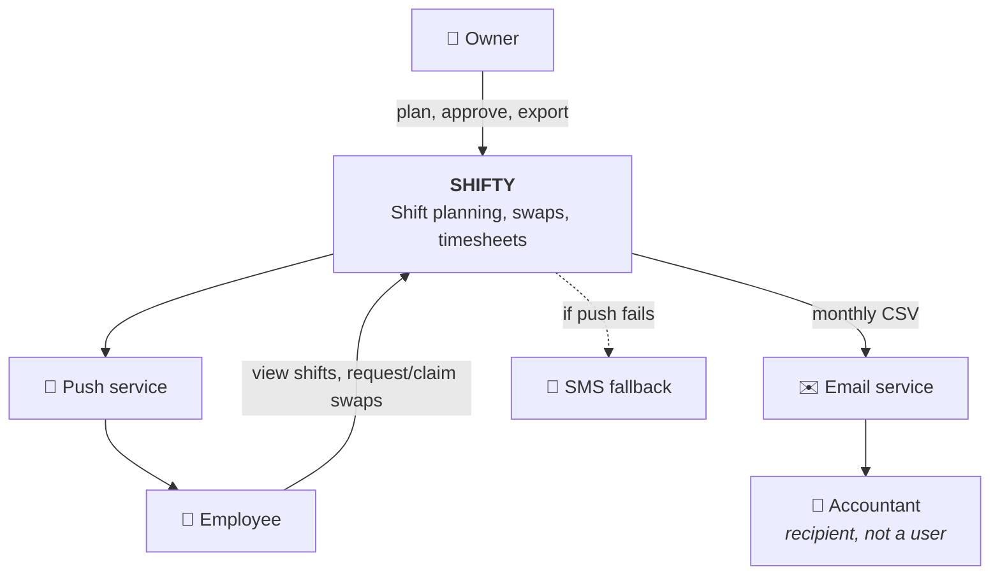
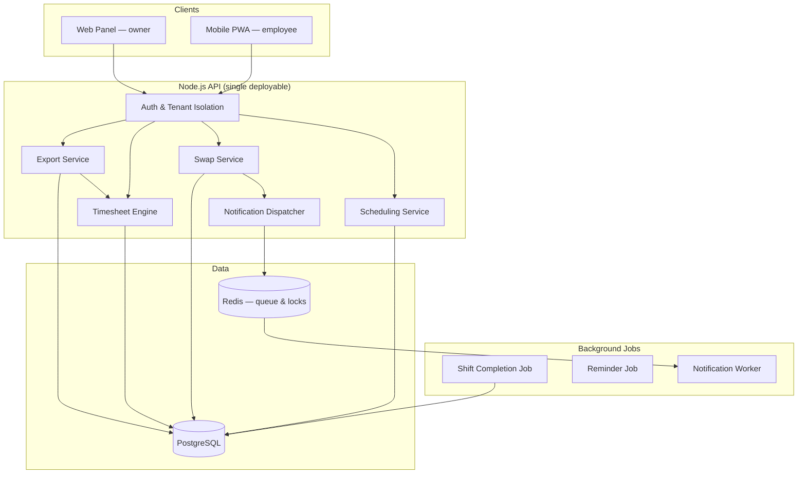
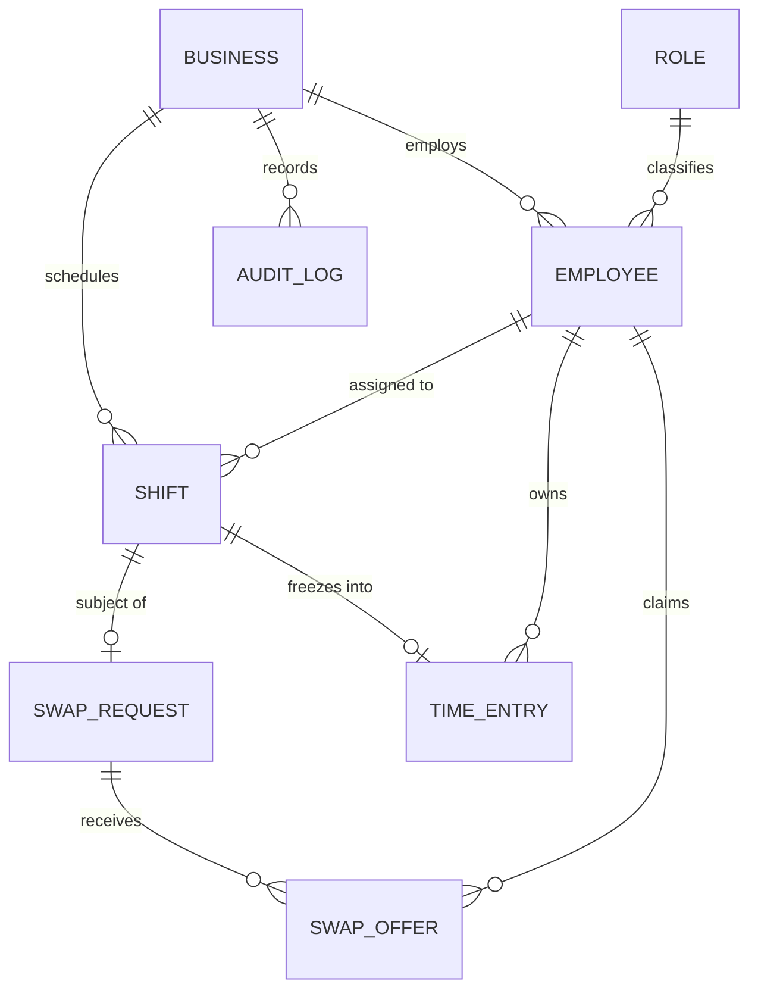

# PART 1 — Mini-Spec (one-pager)

> **Shifty — Shift Swap & Monthly Timesheet**
> Spec v1.1 · Owner: *[you]* · Status: Ready for development · Last review: Day 8

## Problem

Small café owners plan shifts in WhatsApp groups and spreadsheets. Two things break because of it:

1. **Last-minute gaps.** When someone can't make a shift, finding a replacement happens in a group chat with no record. Roughly **3 shifts per month per venue run understaffed**, and nobody can prove afterwards who agreed to what.
2. **Manual timesheets.** At month end the owner retypes hours into a spreadsheet for the accountant. It takes ~2 hours, and errors surface weeks later in payroll — when they are expensive to fix.

Owners spend ~2h/week on scheduling admin and ~2h/month on timesheets, and still get both wrong.

## Users

| User | Role | What they need |
|---|---|---|
| **Denise** — owner | Primary user, buyer | Build the weekly plan fast; keep control of who works when; hand the accountant clean numbers |
| **Ellie / Mark** — staff | Daily users, not buyers | See their own shifts on a phone; offload a shift without looking unreliable |
| **Leo** — accountant | Output recipient, *not* a system user | Hours in the exact format his payroll software expects, by the 1st of the month |

## Scope

**In scope (MVP):** weekly shift planning, employee shift view, swap request + approval, hours calculation (regular / overtime / night), CSV export.
**Out of scope:** pay and salary calculation, POS/revenue integration, live payroll-software integration, hiring and HR workflows, auto-generated schedules.

## User stories

| ID | Story | Size |
|---|---|---|
| **US-01** | As an **owner**, I want to build the weekly shift plan on one screen, so that I stop rebuilding it from scratch every week. | L |
| **US-02** | As an **employee**, I want to see this week's shifts on my phone, so that I don't have to ask anyone when I start. | S |
| **US-03** | As an **employee**, I want to open a swap request for a shift I can't work, so that I can find cover without looking unreliable. | M |
| **US-04** | As an **owner**, I want to approve or reject a swap the staff agreed on, so that the plan never changes behind my back. | M |
| **US-05** | As an **owner**, I want to export monthly hours in my accountant's format, so that payroll isn't delayed by my typing. | L |

**Priority:** US-01 → US-02 → timesheet core → US-03 → US-04 → CSV export. Highest-risk work (hours calculation) is pulled early on purpose, so pilot venues can validate it against two real months before launch.

## Acceptance criteria — the two riskiest stories

### US-03 — Open a swap request

- **Happy path.** *Given* Ellie is assigned a shift, *when* she opens a swap request, *then* it is saved as **Open**, becomes visible to employees with the same role who have no overlapping shift, and the shift stays assigned to her until the request resolves.
- **Cut-off.** *Given* a shift starts in under **2 hours**, *when* an employee tries to open a request, *then* it is refused with a message telling them to contact the owner directly.
- **Overlap.** *Given* Mark already works an overlapping shift, *when* he tries to claim the request, *then* the claim is blocked and the conflicting shift is shown to him.
- **Legal limit.** *Given* claiming would push Mark past **45 hours in the business's defined week**, *then* he is warned and the swap can only proceed with explicit owner approval.
- **Race.** *Given* two employees claim the same request near-simultaneously, *then* only the first is accepted; the second sees "already claimed".
- **Cancel.** *Given* the request is still Open, *when* Ellie withdraws it, *then* it closes as **Cancelled**, disappears from other employees' lists, and her shift is untouched.

### US-05 — Monthly timesheet export

- **Happy path.** *Given* March has completed shifts, *when* Denise exports March, *then* a CSV is produced with one row per employee containing name, staff number, regular minutes, overtime minutes, night minutes and total, named `timesheet-2026-03-<business>.csv`.
- **Completed only.** Cancelled and future-dated shifts are excluded entirely.
- **Midnight crossing.** *Given* a shift runs 31 Mar 20:00 → 1 Apr 04:00, *then* four hours land in March and four in April, and no minute is counted in both periods.
- **Mid-month joiner.** *Given* an employee started 14 March, *then* only shifts from 14 March onward are summed; the employee appears in the file with no pre-hire values.
- **Swapped shift.** *Given* a shift was transferred from Ellie to Mark with approval, *then* those hours appear on Mark's row only.
- **Encoding.** *Given* names contain non-ASCII characters, *then* the file opens intact in the accountant's software (UTF-8 with BOM), with his expected decimal separator, verified at least once by Leo against sample data.
- **Empty period.** *Given* a month with no completed shifts, *then* the export succeeds with a header-only file and an explanatory message — not an error.

## Constraints

- **Business:** 3 people × 3 months of budget. Subscription pricing means the product must show value within the first 15 minutes; no paid onboarding is available. The real competitor is WhatsApp — free and already installed — so "slightly better" is not enough.
- **Time:** pilot live in 3 venues within 10 weeks (before high season). The export must work by the 1st of the month; miss one month-end and the venue reverts to spreadsheets for another cycle.
- **Legal:** personal data (name, phone, working hours) is processed → privacy notice, consent, retention policy and deletion path are mandatory. Labour law (weekly 45h, overtime, rest days, night work) directly shapes the calculation. An employee must never be able to see another employee's hours.
- **Technical:** staff run low-end Android devices on mobile data → the client must stay light and tolerate poor connectivity. Team knows Node.js + PostgreSQL; learning a new stack doesn't fit the timeline. Notification delivery depends on a third party we don't control. **Shifts can cross midnight** — this shapes the data model and cannot be retrofitted cheaply.

## Success metrics (measured on the pilot, 8 weeks)

| Metric | Baseline | Target |
|---|---|---|
| Understaffed shifts per venue per month | 3 | ≤ 1 |
| Owner time spent on month-end timesheet | ~120 min | ≤ 15 min |
| Swap requests resolved without owner intervention | 0% | ≥ 60% |
| Timesheet corrections after export | n/a | ≤ 1 per venue per month |
| Weekly active employees (of those invited) | n/a | ≥ 70% |

## Open questions

| # | Question | Owner | Needed by |
|---|---|---|---|
| Q1 | Exact column order and decimal format Leo's payroll software expects | You → Leo | Before export build starts |
| Q2 | Do pilot venues run night shifts? Determines whether night-hour rules ship in MVP or v1.1 | You → 3 pilots | Sprint 2 planning |
| Q3 | Should owner approval be required when both staff already agreed, or notification only? | Denise | Before US-04 build |
| Q4 | Data retention period after an employee leaves | Legal counsel | Before pilot go-live |

## Milestones

| Sprint | Delivered |
|---|---|
| 1–2 | Auth, business/employee setup, weekly plan (US-01) |
| 3 | Employee mobile view (US-02), notification pipeline |
| 4 | Hours calculation core + first real-data validation against a pilot's manual payroll |
| 5 | Swap request and approval (US-03, US-04) |
| 6 | CSV export in Leo's verified format (US-05), pilot go-live |

---

# PART 2 — Design Attachments

## Context

**Boundary in one line:** we produce **hours**, the accountant's software produces **money**. Payroll liability stays outside the system.

## Components

Key responsibilities: **Scheduling** owns shifts and overlaps · **Swap** owns the request state machine and eligibility · **Timesheet Engine** classifies minutes into legal buckets · **Export** owns file format only · **Dispatcher** decides recipient and channel, never delivers directly.

## Data

Decisions carried by the model: timestamps stored in **UTC**, displayed in business timezone · shifts may **cross midnight**, so start/end timestamps rather than date + shift type · `SwapRequest` and `SwapOffer` are separate so concurrent claims are representable · `TimeEntry` stores **integer minutes** with the rule version used.

## Design decision on record

**TD-001 — Timesheet hours are frozen at shift completion.** A background job writes a `TimeEntry` per completed shift under the rules in force at that moment; export reads only frozen entries. *Rejected:* recalculating from shifts on every request — a later rule change would silently rewrite an already-submitted month, and no audit trail would exist. *Cost accepted:* derived data in two places, plus a recalculation path if a rule turns out to be wrong.

---

# PART 3 — Review Pass

I reviewed v1 as a hostile reader with one question per line: **could two developers read this and build different things?** Nine places failed that test.

| # | v1 said | Why it was unclear | Fixed in v1.1 |
|---|---|---|---|
| 1 | "Employees should be able to swap shifts" | Swap or hand over? A true swap means both give something up; a handover means one person takes a shift. Completely different data model. | Renamed throughout to **handover semantics**: one shift moves from A to B. True two-way swap is explicitly out of MVP scope. |
| 2 | "The owner is notified" | Notified how, when, and is it blocking? | US-04 now states: approval is **required** before the plan changes (pending Q3 confirmation), and the notification channel is specified in the dispatcher's responsibility. |
| 3 | "Weekly 45-hour limit" | Whose week? Calendar week, rolling 7 days, or the business's payroll week? Three different results for the same data. | Now reads "45 hours **in the business's defined week**", and `Business.week_start_day` exists in the model to make it explicit. |
| 4 | "Export the timesheet" | Export what unit — hours or minutes? Decimal or `hh:mm`? Which columns, which order? | AC now specifies **minutes as integers**, named columns, file naming pattern; exact column order raised as blocking question **Q1**. |
| 5 | "Fast enough" (perf note) | Unmeasurable, so untestable. | Replaced with the Day 5 formulation: weekly plan interactive in **< 2s at p95**, on a mid-range Android over 4G, with 20 employees and 4 weeks of data. |
| 6 | "Employees can't see each other's data" | Can they see *who else is working tonight*? They need that for swaps. The rule as written would break US-03. | Sharpened to: employees may see **colleagues' names and shift times**; they may not see **hours totals, pay or timesheet data**. |
| 7 | "Shifts that pass midnight are split" | Split by what boundary — business timezone midnight or UTC midnight? Off-by-one-hour bug factory. | Stated as **business-local midnight**, with the UTC storage rule noted alongside so the conversion is deliberate. |
| 8 | "Notify the employee" (swap claimed) | Which employee — the opener, the claimer, or both? | AC and dispatcher responsibility now name recipients per event explicitly. |
| 9 | No success metrics | "Done" was defined only as "features shipped", which is not the same as "problem solved". | Added the metrics table with baselines, so the pilot can actually falsify the product hypothesis. |

**Two things I deliberately did not fix**

- **Q3 (approval vs. notification-only)** stays open. It is a product decision belonging to Denise, not something I should quietly settle in a spec. It is flagged as blocking for US-04 rather than guessed at.
- **Auto-generated schedules** keep coming up in feedback. It stays in "out of scope" — expanding scope during a review pass is how a one-pager becomes a twelve-pager nobody reads.

---

# PART 4 — Ready-to-Build Check

Question being answered: **could a developer start Monday without guessing core intent?**

| Check | Status | Evidence |
|---|---|---|
| Problem stated with a real cost | ✅ | 3 understaffed shifts/month, ~2h/month of retyping |
| Users named, with the non-user identified | ✅ | Accountant is a recipient, not a login |
| Scope boundary explicit both ways | ✅ | "Out of scope" list, including the tempting ideas |
| Stories have user, want and reason | ✅ | Five stories, all with a "so that" |
| Acceptance criteria testable | ✅ | Both risky stories cover edge cases, not just happy path |
| Non-functional requirement measurable | ✅ | p95 < 2s, defined device/network/data volume |
| Legal constraints identified | ✅ | Privacy obligations, labour-law rules, access separation |
| Architecture boundaries agreed | ✅ | Context, components, data model attached |
| Key trade-off documented with rejected alternative | ✅ | TD-001 |
| Sequencing reflects risk, not convenience | ✅ | Timesheet core pulled ahead of nicer-looking features |
| Success measurable after launch | ✅ | Metrics table with baselines |
| **All open questions resolved** | ⚠️ | **Q1 and Q3 are blocking; Q2 and Q4 are not** |

## Verdict

**Ready to build — sprints 1 through 4.** US-01, US-02 and the timesheet calculation core have no unresolved dependencies; a developer can start on Monday.

**Not ready — sprints 5 and 6.**
- **US-04** is blocked on **Q3**: whether owner approval is mandatory or informational. Building the wrong one means rewriting the state machine.
- **US-05 export** is blocked on **Q1**: Leo's exact column format. Guessing here produces a file that looks correct and is useless.

Both answers are one conversation away and both conversations are scheduled before the sprints that need them. That is what "ready for development" means in practice — not zero unknowns, but **zero unknowns in the work about to start**, with the rest named and owned.

---